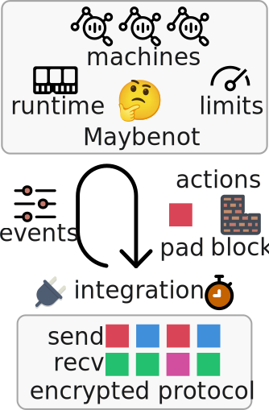

# Maybenot 🤔

Maybenot is a framework for traffic analysis defenses that hide patterns in
encrypted communication. Its goal is to increase the uncertainty of network
attackers, hence its logo 🤔 - the thinking face emoji (U+1F914).

[![Crates.io][crates-badge]][crates-url]
[![Documentation][docs-badge]][docs-url]
[![Build Status][tests-badge]][tests-url]
[![MIT OR Apache-2.0][license-badge]][license-url]

[crates-badge]: https://img.shields.io/crates/v/maybenot.svg
[crates-url]: https://crates.io/crates/maybenot
[docs-badge]: https://docs.rs/maybenot/badge.svg
[docs-url]: https://docs.rs/maybenot
[tests-badge]: https://github.com/maybenot-io/maybenot/actions/workflows/tests.yml/badge.svg
[tests-url]: https://github.com/maybenot-io/maybenot/actions
[license-badge]: https://img.shields.io/crates/l/maybenot
[license-url]: https://github.com/maybenot-io/maybenot/

Consider encrypted communication protocols such as TLS, QUIC, WireGuard, or Tor.
While the connections are encrypted, *patterns* in the encrypted communication
may still leak information about the underlying plaintext being communicated
over encrypted. Maybenot is a framework for creating defenses that hide such
patterns.

To simulate defenses based on Maybenot, see the [Maybenot
simulator](https://github.com/maybenot-io/maybenot-simulator/).

## Design
An instance of Maybenot repeatedly takes as *input* one or more *events*
describing the encrypted traffic going over an encrypted channel, and produces
as *output* zero or more *scheduled actions*, such as to inject *padding*
traffic or *block* outgoing traffic. One or more *state machines* determine what
actions to take based on events. State machines have a lightweight runtime and
are subject to *limits* on the amount of padding a blocking they can schedule.

<p align="center">
<picture>
  <source media="(prefers-color-scheme: dark)" srcset="overview-dark.svg">
  
</picture>
</p>

Integration with an encrypted communication protocol is done by reporting events
and executing scheduled actions. Maybenot does not specify the specific async
runtime or how to keep time for sake of ease of integration.

## Example usage

```rust,no_run
use maybenot::{
framework::{Action, Framework, TriggerEvent},
machine::Machine,
};
use std::{str::FromStr, time::Instant};

// deserialize state machine from string
let s = "789cedca2101000000c230e85f1a8387009f9e351d051503ca0003";
let m = vec![Machine::from_str(s).unwrap()];

// create framework instance
let mut f = Framework::new(&m, 0.0, 0.0, 1420, Instant::now()).unwrap();

loop {
    // collect one or more events
    let events = [TriggerEvent::NonPaddingSent { bytes_sent: 1420 }];

    // trigger events, schedule actions, at most one per machine
    for action in f.trigger_events(&events, Instant::now()) {
        match action {
            Action::Cancel { machine: MachineId } => {
                // if any scheduled action for this machine, cancel it
            }
            Action::InjectPadding {
                timeout: Duration,
                size: u16,
                bypass: bool,
                replace: bool,
                machine: MachineId,
            } => {
                // schedule padding of a specific size after timeout
            }
            Action::BlockOutgoing {
                timeout: Duration,
                duration: Duration,
                bypass: bool,
                replace: bool,
                machine: MachineId,
            } => {
                // schedule blocking of outgoing traffic for duration after timeout
            }
        }
    }
}
 ```

## Origin
Maybenot is based on the [Circuit Padding Framework of
Tor](https://gitweb.torproject.org/tor.git/plain/doc/HACKING/CircuitPaddingDevelopment.md)
by Mike Perry and George Kadianakis from 2019, which is a generalization of the
[WTF-PAD Website Fingerprinting Defense](https://arxiv.org/pdf/1512.00524.pdf)
design by Juarez et al. from 2016, which in turn is based on the concept of
[Adaptive Padding](https://www.cs.utexas.edu/~shmat/shmat_esorics06.pdf) by
Shmatikov and Wang from 2006.

## More details
See the [paper](https://doi.org/10.1145/3603216.3624953) and
[documentation](https://docs.rs/maybenot/latest/maybenot) for further details on
the framework.